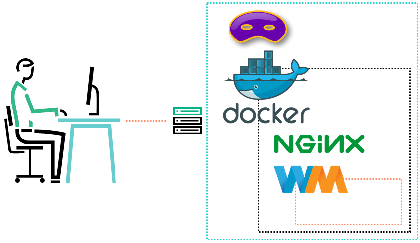
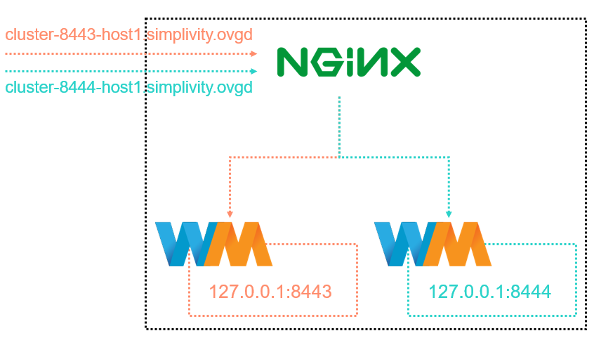

# Service Virtualization Environment

As part of the [HPE OneView Global Dashboard](https://www.hpe.com/us/en/product-catalog/detail/pip.1009187269.html) project, an environment to simulate services has been developed. This environment has the following main purposes:
* Allow developers to simulate a service that is not completed yet (allowing them to stay productive);
* Build a stable and scalable integration testing environment;
* Deploy as many services as needed to execute the application scaling tests.

## Technologies
Below are the technologies used to build the virtualization environment:
* [Dnsmasq](http://www.thekelleys.org.uk/dnsmasq/doc.html)
  * Lightweight service that provides network infrastructure functionalities such as DNS and DHCP.
  * Specify an IP address for a given domain: https://wiki.archlinux.org/index.php/dnsmasq#Override_addresses
* [Docker](https://www.docker.com/)
  * Platform that provides a way to run application isolated in a container.
  * Docker run reference: https://docs.docker.com/engine/reference/run/
* [NGINX](https://www.nginx.com/)
  * Open source web server and reverse proxy.
  * Passing a request to a proxied server: https://www.nginx.com/resources/admin-guide/reverse-proxy/
  * Regular expressions for server names: http://nginx.org/en/docs/http/server_names.html#regex_names
  * SSL configuration: https://www.digitalocean.com/community/tutorials/how-to-create-a-self-signed-ssl-certificate-for-nginx-in-ubuntu-16-04
* [WireMock](http://wiremock.org/)
  * HTTP mock server tool that can serve pre-defined responses to particular requests.
  * Standalone process: http://wiremock.org/docs/running-standalone/
  * Running inside a Docker container: https://github.com/lhsvobodaj/docker-wiremock

## Overall Environment Architecture

The virtualization environment is composed of a virtual machine running Ubuntu Server 16.04 with Dnsmasq and Docker services running as native processes, while the other tools that complete the setup (NGINX and WireMock) are running as containers.

* Services running on the host VM
  * Dnsmasq: provides DNS capabilities.
  * Docker: allows the environment to scale.

* Services running as containers
  * NGINX: configured as a reverse proxy.
  * WireMock: allows the virtualization of any REST service.



## Request Routing
Using NGINX as a reverse proxy, it is possible to send the HTTP request to a specific proxied server. In this case, the request is routed according to the request hostname. The domain name chosen to host our mocked environment is **simplivity.ovgd**. Thus, the `server_name` field in the NGINX configuration file is defined using a regular expression as `cluster-<PORT>-host<ID>.simplivity.ovgd`.

According to the provided hostname, the request is routed to the server running on the port defined by the `<PORT>` portion of the address. See the NGINX virtual server configuration below:
```bash
server {
    listen 443 ssl;
    server_name "~^cluster-(?<port>\d{4})-host\d{1}\.simplivity\.ovgd$";
    ssl_certificate /etc/nginx/certs/nginx.crt;
    ssl_certificate_key /etc/nginx/certs/nginx.key;
    location / {
        proxy_pass https://127.0.0.1:$port;
    }
}
```


## How to use the environment?
**TODO**
